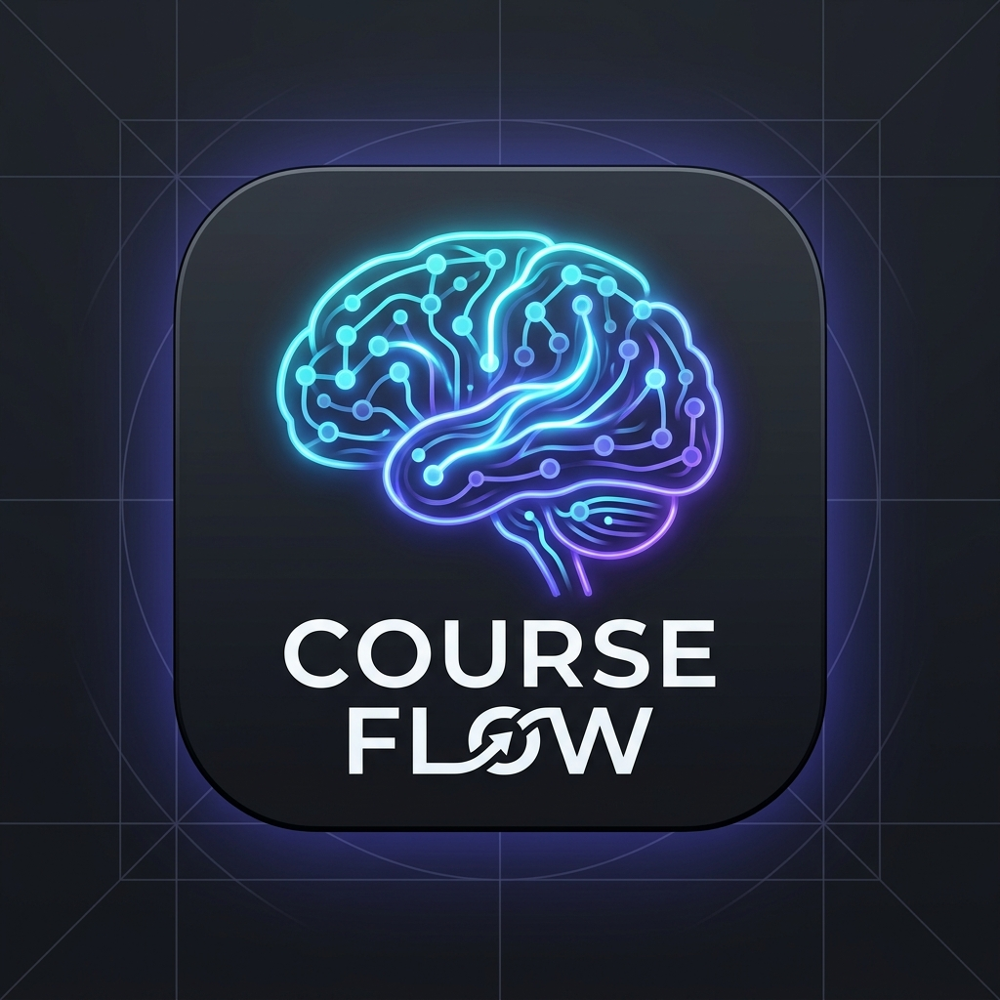

<div align="center">
  
  
  # 🚀 CourseFlow
  
  ### Интерактивная учебная платформа нового поколения в формате VK Mini App (VKMA)
  
  [](https://nextjs.org/)
  [](https://vk.com/dev/vk_bridge)
  [](https://www.typescriptlang.org/)
  [](https://firebase.google.com/)
  [](https://tailwindcss.com/)

  *Красивый, быстрый и отзывчивый инструмент для освоения ИИ, ООП-программирования и мобильной разработки прямо внутри ВКонтакте.*
</div>

---

## ✨ Уникальные Особенности и Возможности

### 🔗 Официальная интеграция с VK Bridge
* **Мгновенная инициализация**: Бесшовный старт приложения в мобильном клиенте без задержек.
* **Автосинхронизация тем**: Полное динамическое переключение светлой/темной темы в реальном времени, идеально подстраивающееся под настройки темы ВКонтакте пользователя.
* **Реальный профиль**: Загрузка имени, фамилии и аватара пользователя напрямую из его VK-аккаунта (`VKWebAppGetUserInfo`).

### 🎨 Премиальный UX/UI и Дизайн
* **Приветственная карусель (Onboarding)**: Великолепное интерактивное трехстраничное окно знакомства с плавными Framer Motion переходами и динамическими фоновыми градиентами.
* **Плавающий Bottom Bar**: Удобная стеклянная (glassmorphic) нижняя панель навигации для мобильных экранов, спроектированная с учетом эргономики работы одним пальцем.
* **Тактильный отклик (Tactile Scaling)**: Пружинный 3D-эффект нажатия (`transform: scale(0.97)`) на все кнопки, квизы и карточки для ощущения премиальности управления.

### 🧠 Глубокий Интерактив и Практика
* **Умные викторины**: Моментальная цветовая оценка ответов (изумрудная подсветка правильного и розовая — неверного) с мгновенным скрытием невыбранных вариантов и выводом красивых иконок галочки/крестика.
* **Эффектный финиш урока**: Поздравительная анимированная карточка при прохождении практического задания с возможностью перехода к следующему уроку в один клик.
* **Аналитические дашборды**: Недельные интерактивные графики прогресса, построенные на `Recharts`, в детальном меню профиля студента.

---

## 🛠 Технологический Стек

* **Фреймворк**: [Next.js 15 (App Router)](https://nextjs.org/)
* **База данных и прогресс**: [Firebase & Firestore](https://firebase.google.com/)
* **Стиль**: Vanilla CSS + [Tailwind CSS v4](https://tailwindcss.com/)
* **Анимации**: [Framer Motion (Motion)](https://motion.dev/)
* **Графика**: [Recharts (D3)](https://recharts.org/) & [Lucide Icons](https://lucide.dev/)
* **VK API**: [@vkontakte/vk-bridge](https://vk.com/dev/vk_bridge)

---

## 🚀 Быстрый старт локально

### Требования
Убедитесь, что у вас установлен **Node.js** версии `18.x` или выше.

1. **Клонируйте проект и перейдите в его папку**:
   ```bash
   cd courseflow
   ```

2. **Установите все зависимости**:
   ```bash
   npm install
   ```

3. **Запустите сервер разработки**:
   ```bash
   npm run dev
   ```

4. **Откройте приложение**:
   Перейдите по адресу **[http://localhost:3000](http://localhost:3000)** в вашем браузере.

---


---

<div align="center">
  Разработано с заботой о пользователях и вниманием к мельчайшим деталям UI/UX. 🎓✨
</div>
